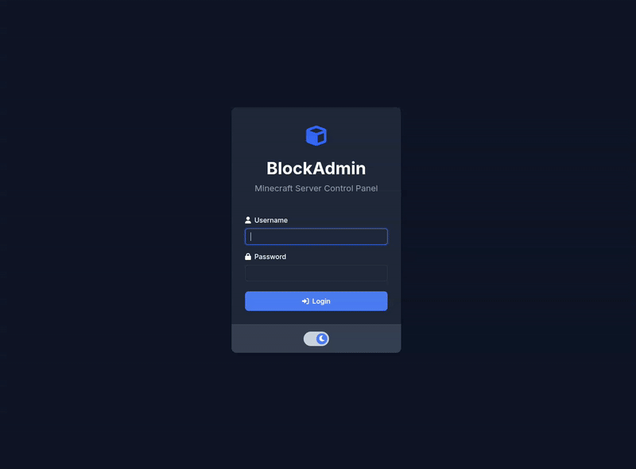

# BlockAdmin
> A Minecraft server managment application.




## Requirements
-  Docker
- A Minecraft server with RCON enabled ([Read Here for instructions](https://help.akliz.net/docs/using-rcon-with-your-minecraft-server)).


## Installation
Download the latest release and extract the zip file to a directory of your choosing. 

Alternatively, Run the following commands:
``` bash
git clone https://github.com/TBindloss/BlockAdmin.git
```
Go into the project directory and run the following commands:
``` bash
docker build -t blockadmin:latest -f Docker/Dockerfile .
docker run --name blockadmin -p 8000:8000 -d blockadmin:latest
``` 

Head to http://localhost:8000 and login with the credentials:
- Username: admin
- Password: admin
<br>

Head to the 'Admin' page and change the admin password.
<br>
Head back to the 'Admin' page and input your RCON credentials. This will connect the app to the server. You can confirm this by viewing the 'Server Information' area on the main page, it should show as connected.